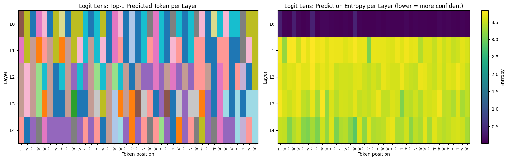
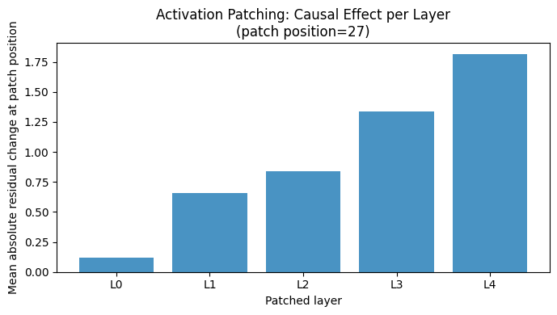
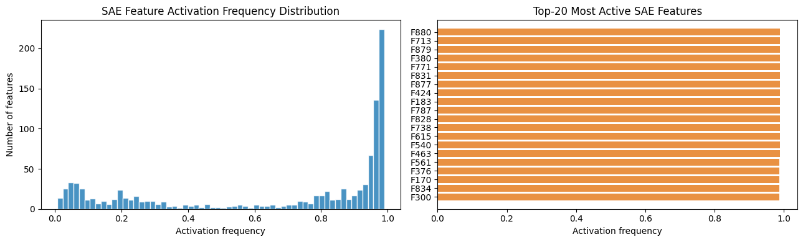

# 🔬 JAX Interpretability — Mechanistic Interpretability of Transformer Representations

This repository builds a character-level Transformer from scratch in JAX/Flax and investigates how internal representations evolve using mechanistic interpretability techniques. The project trains a small transformer on Shakespeare text, then applies Logit Lens, Activation Patching, and Sparse Autoencoders (SAEs) to inspect how information moves through the model.

---

# Overview

This project demonstrates how to build a research-style interpretability workflow with:

- Transformer implementation from scratch in JAX/Flax
- Character-level language modeling on Shakespeare text
- Training and validation loss tracking
- Logit Lens analysis across transformer layers
- Activation Patching for causal intervention experiments
- Sparse Autoencoder feature learning on residual stream activations
- Portfolio-ready interpretability visualizations
- Reproducible experimentation on a single GPU

---

# Problem Context: Mechanistic Interpretability

Modern language models are often evaluated only by their external behaviour: loss, accuracy, benchmark scores, or generated samples. Mechanistic interpretability asks a deeper question:

> What internal computations produce that behaviour?

Instead of treating the model as a black box, this project studies intermediate representations inside a transformer. The goal is to understand how token-prediction information emerges, how later layers affect output decisions, and whether sparse features can be learned from hidden activations.

This is relevant to AI safety because understanding internal representations may help researchers identify model circuits, diagnose failure modes, and develop better tools for auditing model behaviour.

---

# Methodological Approach

The project begins by training a small character-level transformer and then applies three complementary interpretability methods:

## Logit Lens

Logit Lens projects intermediate residual stream activations through the model's unembedding matrix to estimate what token the model would predict at each layer.

This helps answer:

- When do token predictions become confident?
- Which layers carry useful predictive information?
- Does the model's belief evolve smoothly or change abruptly across layers?

## Activation Patching

Activation Patching performs a causal intervention by replacing a corrupted run's residual stream with activations from a clean run at specific layers.

This helps answer:

- Which layers causally affect a target prediction?
- Do later layers contribute more to recovering the correct token?
- Where does the model appear to perform decision-relevant computation?

## Sparse Autoencoder Analysis

A Sparse Autoencoder is trained on residual stream activations from a middle transformer layer.

This helps answer:

- Can dense hidden states be decomposed into sparse features?
- How many SAE features are active on average?
- Which features are frequently used across activation samples?

---

# Model Setup

The transformer is intentionally small so the full workflow can run on consumer-accessible hardware.

- **Task:** character-level language modeling
- **Dataset:** Tiny Shakespeare
- **Framework:** JAX / Flax
- **Model size:** 816,128 parameters
- **Architecture:** 4-layer causal transformer
- **Hidden size:** 128
- **Attention heads:** 4
- **Training:** 2,000 optimization steps
- **Hardware:** single T4 GPU

The purpose is not to maximize language modeling performance. The purpose is to train a model that learns enough structure for interpretability experiments to be meaningful.

---

# Results Summary

## Training Stability

The model trained stably over 2,000 steps. Training and validation loss decreased together, suggesting the model learned useful structure without severe overfitting.

| Step | Train Loss | Validation Loss |
| ---: | ---------: | --------------: |
|  100 |     3.2079 |          3.2430 |
|  500 |     2.2808 |          2.3013 |
| 1000 |     2.0033 |          2.1033 |
| 1500 |     1.8307 |          1.9517 |
| 2000 |     1.8288 |          1.9237 |

## Logit Lens

The Logit Lens analysis showed that the embedding layer alone carried limited token-prediction information, while prediction confidence changed sharply after the first transformer block.

This suggests that early transformer computation plays a major role in converting raw token embeddings into prediction-relevant representations.

## Activation Patching

Activation patching showed larger causal effects in later layers, with the strongest patch effect observed in the final transformer layer.

This suggests that later residual stream activations contributed more strongly to recovering the target-token prediction after corruption.

## Sparse Autoencoder

The SAE analysis provided a first pass at decomposing residual stream activations into sparse feature representations.

| Metric               |        Value |
| -------------------- | -----------: |
| Reconstruction MSE   |       0.0043 |
| Fraction zeros       |        0.330 |
| Mean active features | 685.7 / 1024 |

---

# Key Features

## Transformer From Scratch

The project implements a causal transformer in JAX/Flax rather than relying on a prebuilt language model.

This includes:

- token embeddings
- causal self-attention
- transformer blocks
- residual stream tracking
- language modeling head
- autoregressive text generation

## Residual Stream Analysis

The notebook captures residual stream activations across layers and reuses them for interpretability experiments.

## Causal Intervention Experiments

Activation patching tests whether replacing internal activations changes the model's output behaviour, moving the project beyond purely correlational visualization.

## Sparse Feature Learning

The SAE module trains a sparse representation over residual activations and reports reconstruction quality and feature usage.

---

# Figures

## Logit Lens



## Activation Patching



## SAE Features



---

# Tech Stack

**Language:** Python

**Deep Learning:** JAX, Flax, Optax

**Checkpointing:** Orbax Checkpoint

**Numerical Computing:** NumPy

**Visualization:** Matplotlib

**Dataset:** Tiny Shakespeare

**Platform:** Google Colab / NVIDIA T4 GPU

**Research Area:** Mechanistic Interpretability, Transformer Internals, AI Safety

---

# Repository Structure

```text
jax-interpretability/
│
├── notebook/
│   ├── JAX_Interpretability.ipynb
│   └── jax_interpretability_reference.py
│
├── paper/
│   └── .gitkeep
│
├── figures/
│   ├── training_curve.png
│   ├── logit_lens.png
│   ├── activation_patching.png
│   ├── sae_training_curve.png
│   ├── sae_features.png
│   ├── portfolio_stat_card.png
│   ├── portfolio_interpretability_summary.png
│   └── portfolio_sae_dashboard.png
│
├── results/
│   ├── report.md
│   └── summary.json
│
├── requirements.txt
├── LICENSE
└── README.md
```

---

# Setup & Usage

Install dependencies:

```bash
pip install -r requirements.txt
```

Run the notebook:

```text
notebook/JAX_Interpretability.ipynb
```

A CUDA-enabled GPU is recommended for faster training.

---

# Evaluation Pipeline

The workflow consists of five stages:

## 1) Data Preparation

Downloads and tokenizes Tiny Shakespeare for character-level language modeling.

## 2) Transformer Training

Trains a small causal transformer and tracks training/validation loss.

## 3) Logit Lens

Projects intermediate activations into vocabulary space to inspect prediction evolution across layers.

## 4) Activation Patching

Runs clean and corrupted prompts, patches residual activations layer-by-layer, and measures recovery of the target-token logit.

## 5) Sparse Autoencoder Training

Trains an SAE on residual stream activations and evaluates reconstruction error, sparsity, and feature usage.

---

# Outputs

The project generates:

- Training curves
- Logit Lens heatmaps
- Activation patching causal effect plots
- SAE training curves
- SAE feature usage plots
- Experiment summary report
- Reproducible result files

---

# Future Work

- Add attention-head level analysis
- Add induction-head style synthetic tasks
- Compare multiple transformer sizes
- Train SAEs with stronger sparsity constraints
- Add feature dashboards for top SAE activations
- Evaluate whether discovered features transfer across prompts

---

# Key Takeaway

Training a transformer is only the first step.

This project shows how interpretability tools can be layered onto a small language model to inspect prediction formation, test causal effects of internal activations, and begin decomposing residual stream representations into sparse features.
